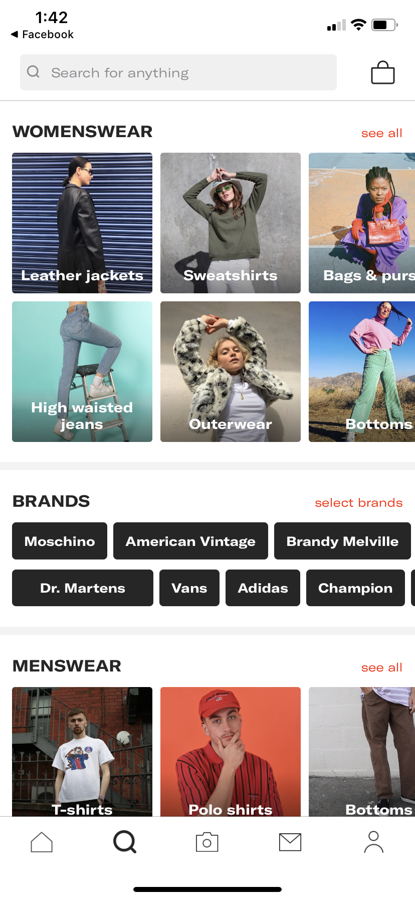
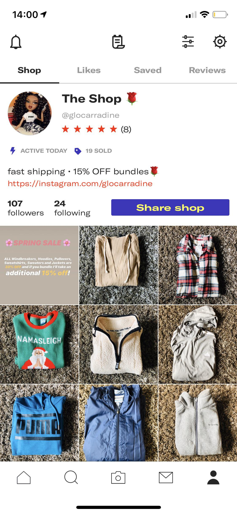
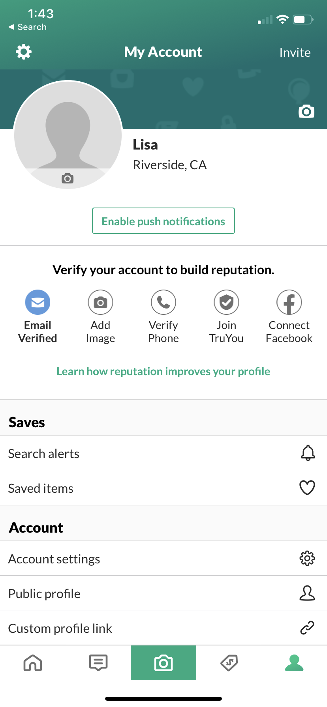

### Heuristic Evaluation

Lisa Bi 	 
Digital Humanities 150

For my project, I will be designing an online resale marketplace with an emphasis on peer-to-peer interaction. The audience in mind will be middle-aged women. For my heuristic evaluation, I will be evaluating Depop and OfferUp, two popular online resale marketplaces with strong user interaction, but very different approaches toward user experience design.

## Depop: 
https://www.depop.com/ 
Depop is a peer-to-peer resale marketplace which incorporates aspects of social media. It carries strong inspiration from instagram. The simple but unique interface makes it very easy to shop for items, as well as list your own items. The site is very popular among Gen Z and Millenial women. Although the target audience different from my own project, I have decided to evaluate to evaluate this platform because of it's large cultural reach and it's success in tapping into new trends among consumers such as a preference for sustainable fashion over fast fashion. My overall evaluation is that Depop is well designed with a modern and user friendly interface. 

## OfferUp: 
https://offerup.com/ 
OfferUp is a an online market place with an emphasis on in-person transactions. It is comparable to Craigslist and Facebook Marketplace, but it differentiates itself by being mobile-friendly with a user rating system. On each item, customers have the option to ask the seller about the item and/or make an offer for the item. Sellers have the option of offering pickup, shipping, or both. It differentiates itself from other app-based marketplaces by its focus on in-person transactions, whereas most other marketplaces (Ebay, Poshmark, Mercari, etc.) only offer shipping. My overall evaluation is that while the app is definitely usable, there are certain usability issues that make the app feel unfinished and outdated.  

### Visibility of System Status:
- In Depop, something that obscured the system status for me was the "buy" button. In most marketplaces, the purchase button reads "Add to cart" or "Add to basket." The "buy" button confused me because I wasn't sure if it was a one-touch purchase (such as the "Buy now" button on Amazon") where they purchase would be processed immediately or if it would simply add the product to my basket. This was confusing to me as a first-time user. After testing it, I realized that the buy button simply adds the product to my basket. (Severity = 2)
- OfferUp has good system visibility. On the main page, it's easy to tell whether you are looking at items available for pickup and items available for shipment. Moreover, you can tell which location you are set to, and switch it with one click. 

### Match between system and real world:
- In Depop, the 'My DNA' tab, where users can view their saved items and their 'style edit'(a listing of items that are similar to recently viewed items), was the only feature that seemed unfamiliar. (Severity = 1)
- In OfferUp, there is an option to create 'boards,' which are subcategories of saved items, similar to Pinterest boards. I thought it was a strange choice to name them boards, and I was initially confused about what this meant. It makes sense in Pinterest because people use Pinterest as a digital visionboard/moodboard, but it makes less sense for a shopping platform, which does not have an association with boards. Moreover, since it's a resale platform, it's likely that many of the items saved on boards will be gone soon. Or, once the user buys the item, they will have no use for the board anymore. For this reason, I thought the inclusion of boards as opposed to a simplified bookmark feature was strange. (Severity = 2)

### User control and freedom:
- In Depop, something I did not like is that if you click the 'Find my style' button, you cannot exit without completing the process, in which you have to select styles, brands, and your clothing sizes. This annoyed me because I had clicked the button accidentally. Moreover, once you pick these options, you have to go into your settings to change them. Since this likely effects which items appear on your feed, it was frustrating to have to look around the app to change them. Features that I did like were to ability to copy previous listings. This seems very useful because many people will sell multiple items that are similar. (Severity = 1)
- In Offerup, it was frustrating trying to delete my listing. There was no option to delete the listing. Instead, I had to set it to 'sold,' and then archive the listing. This was a frustrating design choice (Severity = 3). A feature I did like was the ability to easily toggle between viewing objects that are available for pickup, objects that are available for shipping, and objects that are available through both methods. This is a very appealing feature because I most platforms make it more complicated to adjust the method, or only allow one method of the two. In this case, it's one click to switch, which is very streamlined. Additionally, you can also easily switch the category of items you are looking at. This is important especially for this platform because of how broad the product selection is. 

### Consistency and standards:
- Both Depop and OfferUp seem to have fairly loose standards in regards to what information that sellers are required to include with their listings. On both platforms, the process for listing items are extremely simple, and would probably only take a couple of minutes. The listing process on OfferUp is especially simple, where all you have to do is take a picture, write an (optional) description, and set a price. From a seller stand point, this is very appealing because it simplifies the listing process, which can be a barrier when it's overly complicated. At the same time, there is a lack of standards for product descriptions and product information provided, which can be a negative for customers. Other platforms such as Ebay, Etsy, and Poshmark require the seller to provide more information (size and color for clothes, SKU number, product condition, etc.) which creates standardization across the platform, but can also act as a barrier because of how long it takes to list items. (Severity = 1)

### Error Prevention:
- In Depop, when listing an item, you can choose from a list of brands. This is convenient because it's often easy to get the spelling wrong, which could potentially hurt the reach of your item when people try to search for it.
- OfferUp is similar to Craigslist and Facebook Marketplace in that sellers often forget or do not take down listings of items that are sold. Therefore, some of the items listed are not actually available. (Severity = 1)

### Recognition rather than recall:
- In both interfaces, when you click the search bar, you see a list of previous searches. This is useful because people often will search the same thing more than once. When creating listings, both interfaces also suggest pre-existing categories, which is useful. 

### Flexibility and efficiency of use
- In Depop, you can like/save an image by double tapping it. This is useful because many users like to save things and come back to them later. Moreover, double-tapping is easier than clicking the small heart icon. In addition, the search page shows many clothing categories by default, which is useful for people who are just exploring without a particular item in mind. However, the lack of prices displayed on the image grid makes the interface less efficient to use, since users have to click through to see the price. In addition, changing your preferred styles and brands requires you to your profile and then your settings, which is inefficient. (Severity = 1)
- In OfferUp, saving an item is inefficient. If requires that you click a tiny icon in the very top corner of the image, and then select a board to save the item to. This process could be greatly simplified. (Severity = 3).

### Aesthetic and minimal design:
- Depop's design is very simple, but also quite distinct. The listings are displayed very minimalistically - when viewing the 'Explore' or 'Search' tab, the items do not show titles or prices. It is reminiscint of an Instagram or Pinterest feed, where images are displayed in a grid. I am very curious about the decision to not display prices unless you click the item. Although this makes the interface very minimalistic and pleasant to view, from a customer perspective, it's frustrating to have to click the products to see the price. Since this is a resale marketplace, most users care about affordability. My decision to buy something pretty much always heavily depends on the price, so from a user perspective, this is a negative. (Severity = 2)
- Like Depop, OfferUp displays an image grid, without product titles or prices (you must click the product to see this information). At the same time, the design feels more clunky, more generic, and less minimal. Whereas Depop displays all images at the same size and ratio, product images in OfferUp are all different image ratios, which makes the interface appear messier and more cluttered. The 'My Account' page is especially cluttered, and could be significantly simplified. (Severity = 3)

### Help users recognize, diagnose, and recover from errors:
- In Depop, there is no way to exit the 'Find my Style' button if you accidentally click it. Also, when I attempted to login with my Apple ID, I wasn't able to login because I already had an account with that email. It prompted me to login by manually inputting my information. This was very frustrating because I was trying to login in the first place, not create a new account. Logically, the error message does not make sense. Eventually I was locked out after only a few attempts, which frustrated me. (Severity = 2)
- In OfferUp, error messages do not offer any useful information. When I first attempted to make an account, I got an error message reading, "Oops! Please check your information and try again" followed by an error code. This does not give me any information to help recognize, diagnose, and fix the error. From a user perspective, it could be from any number of possible errors (email already has an account, password is too simple, system is down, etc.). From a usability perspective, this is poor design. (Severity = 3)

### Help and documentation
- Both Depop and OfferUp include FAQs with their platform. OfferUp's FAQ is more extensive, but the organization is poor and there is arguably too much information. Moreover, OfferUp's FAQ page is not actually part of the app. Rather, clicking the FAQ leads you to a webpage outside of the app. Notably, neither provides live support, such as through a live chat or phone number. (Severity = 1)
